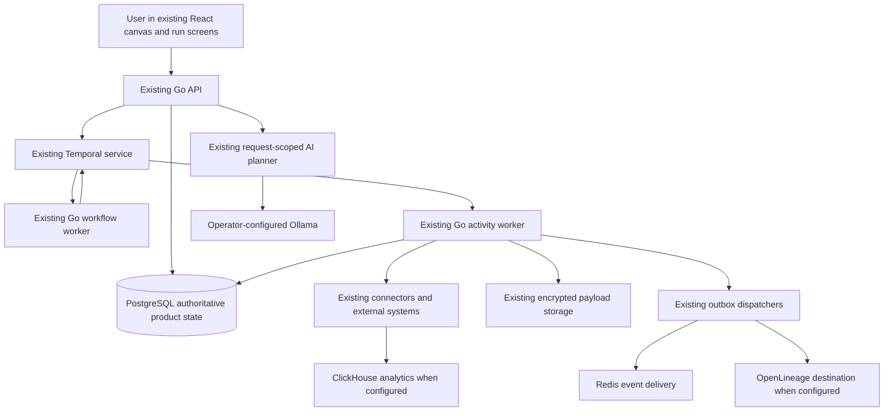
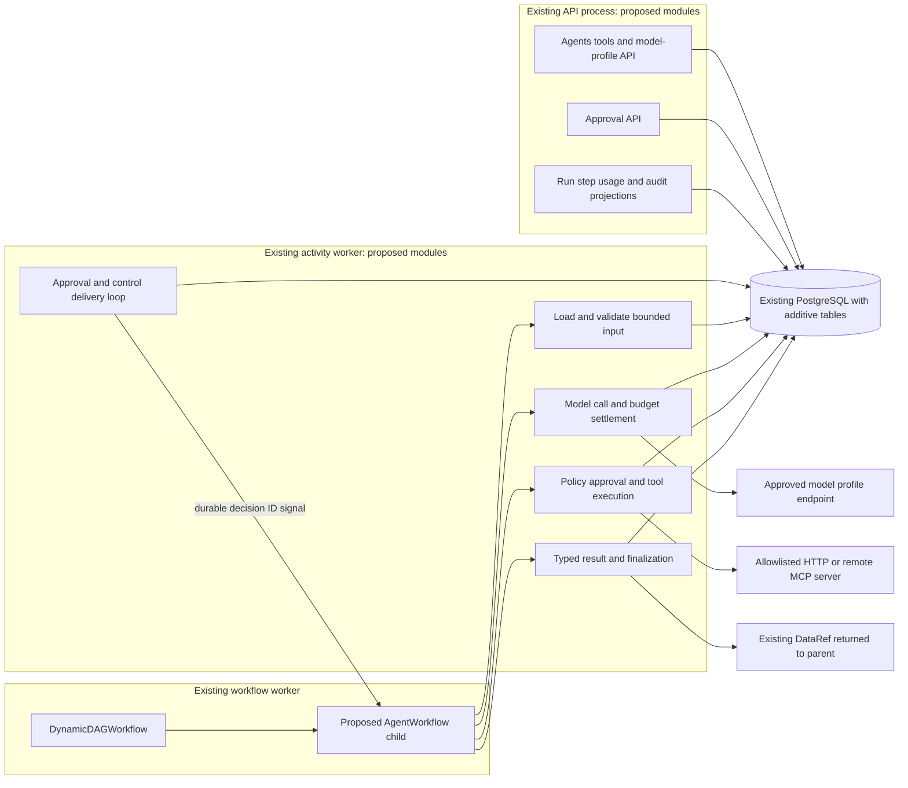
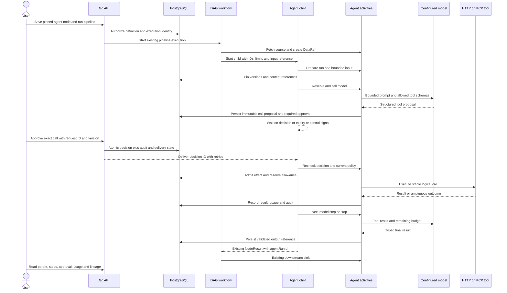

# Cohestra agents: high-level design

Status: implementation design, 2026-09-14. The user approved the agent planning direction in PRs [38](https://github.com/Cohestra/cohestra-dataflow/pull/38), [39](https://github.com/Cohestra/cohestra-dataflow/pull/39), and [40](https://github.com/Cohestra/cohestra-dataflow/pull/40). This document develops that direction; it does not claim that the proposed components have shipped or that the PRs have merged. Application baseline remains `857f36f51d9d58c05b32a4d2941448b1eeebbcbd`.

Read with [backend architecture](BACKEND_ARCHITECTURE.md), [backend LLD](BACKEND_LLD.md), [frontend LLD](FRONTEND_LLD.md), and [sandbox gates](SANDBOX_AND_CI.md). The [Notion current-architecture document](https://app.notion.com/p/3b4d16966d4a81409facca2bbe3c31f5) is useful historical context from the August snapshot; current source is authoritative. This is an extension of the existing modular monolith, not a replacement topology.

## 1. Product outcome and first release

A user selects a saved agent version in the existing canvas, binds a bounded source batch, runs the pipeline, reviews any proposed mutation, and inspects the resulting data, usage, decisions, and effects in one execution. The operational path is **source → agent → approval → HTTP/MCP tool → agent final output → sink**. Read tools may skip approval only when server policy permits.

V1 keeps the current Go backend, Temporal, PostgreSQL, credentials, payload encryption, and React application. It adds a bounded native child workflow, versioned definitions, tool policy, approval records, and step/usage records. It supports the `workflow` engine only. Native agents must be rejected for stream-direct, Spark, and Flink; those existing optional/enterprise paths continue separately. Local stdio tools, arbitrary code execution, per-record fan-out, autonomous workspace memory, and a generic adapter framework are outside v1. LangGraph and cross-run memory remain [deferred options](README.md#deferred-options), without a committed delivery milestone. Revisit LangGraph only when a concrete existing Python agent needs reuse under the same execution, tool, approval, budget and cancellation contracts; the core runtime requires no new backend language.

Pipeline generation/refinement is an authoring feature, distinct from execution. Current planner evaluation includes unsatisfiable corpus cases that must be corrected before model promotion. That work does not block B1/B2 or scripted-model runtime tests. Neither Granite nor another downloaded model becomes an approved default through this design; model profiles carry operator configuration and timestamped capability/evaluation evidence.

## 2. Current topology and extension boundaries

PostgreSQL is the authority for definitions, authorization, audit, approval decisions, call admission, usage reservations, and read projections. Temporal is the authority for orchestration history, timers, activity completion, and replay. Redis, analytics stores, and exported lineage are derived delivery/read systems, not permission or budget authorities. Existing Temporal persistence/visibility deployment configuration is retained; this plan requires no new Cassandra/Elasticsearch installation or replacement.

Keep queues `dynamic-dag-{test,prod}` and `dynamic-activities-{test,prod}` initially. Register the child workflow and activities in existing workers. Workflow code contains only deterministic scheduling/state; activities own network, SQL, crypto, credentials, schema validation, and reference reads. APIs never wait for an entire agent run. A later dedicated agent activity queue is justified only by measured starvation of data work.

Existing outbox dispatchers are started by the [activity-worker entrypoint](../../../apps/workflow-go/cmd/activity-worker/main.go); proposed approval/control delivery uses that lifecycle, while the API owns decision transactions.

Existing reuse points: [DAG runtime](../../../apps/workflow-go/internal/workflows/dynamic_dag.go), [execution start](../../../apps/workflow-go/internal/api/temporal.go), [auth and pipeline ACL](../../../apps/workflow-go/internal/api/auth.go), [tenant transactions](../../../apps/workflow-go/internal/database/database.go), [payloads](../../../apps/workflow-go/internal/activities/payloads.go), [connector transport](../../../apps/workflow-go/internal/connectors/runtime.go), and [dispatchers](../../../apps/workflow-go/internal/dispatchers/dispatchers.go).

## 3. End-to-end operation

Approval records are authoritative in PostgreSQL. Signals only wake the child to read them, so an HTTP acknowledgement means a decision was recorded, not that an external action happened. First valid committed approval/expiry transition wins. Current permissions and cancellation are rechecked at effect admission. A permission change can stop an approved but not-yet-admitted tool call.

## 4. Core invariants

| Boundary | Required invariant |
| --- | --- |
| Versioning | Pipeline pins an immutable agent version, which pins tool versions and a model profile snapshot. Disabling/revocation remains a live deny control. No silent version upgrade. |
| Tenant and data | Tenant/actor/run identity is server-derived; every referenced connection, content row, and storage key is checked. The model cannot choose a credential or resource owner. |
| Effects | All mutations require an authorized human approval bound to exact tool, destination, connection and normalized arguments. Completed logical calls reuse their result. |
| Recovery | At-least-once activity delivery is assumed. Remote idempotency or reconciliation proves safe repetition; otherwise uncertain writes stop as unknown outcome. |
| Budgets | Reserve before each billable attempt and settle once. Unknown usage retains its reservation; local inference is not displayed as known zero cost. |
| Control | Pause prevents later admission but does not undo work. Cancel cooperatively reaches children/HTTP calls; previously admitted remote work may complete and must be reconciled. |
| Privacy | Sensitive agent bodies are encrypted and externally referenced, including small bodies. No credentials or hidden reasoning in workflow history, previews or exports. |
| Operation | Basic steps, decisions, usage and failure reasons are available wherever agents run, including the OSS milestone. Deep Temporal trace can retain its existing edition policy. |

## 5. Initial capacity and operational defaults

No production throughput or availability SLO has been supplied. Use explicit bounds and measure on intended hardware before assigning an SLO. Initial defaults are eight model attempts including repairs, four logical tool calls, 16,384 cumulative input tokens, 4,096 cumulative output tokens, 512 output tokens per model call, a 900-second run deadline, and an approval TTL of at most 600 seconds within that deadline. A bounded batch selects at most 100 records. Operator profile/tenant limits can tighten these values; publication validates their consistency.

Process one tool at a time within a run. Existing DAG concurrency bounds simultaneous nodes; budget reservations also serialize on the run row. For the 18 GiB local Ollama host, each approved profile starts with deploymentConcurrency=1. Enforce this across all calling workers/namespaces at the shared server: explicitly set OLLAMA_NUM_PARALLEL=1, OLLAMA_MAX_LOADED_MODELS=1 and a bounded OLLAMA_MAX_QUEUE (initially 8). These native controls limit parallel processing, loaded models and queued requests. [Ollama FAQ](https://docs.ollama.com/faq). Validate effective host settings and concurrent requests before enabling the profile; a per-process semaphore or serial agent loop alone is insufficient. Queue saturation is a retryable capacity response within the existing deadline/budget, and observed queue time is separate from inference latency. Raising concurrency requires intended-hardware evidence. The LLD gives payload/context bounds; no unbounded history or full-dataset prompt is permitted.

Run-local memory defaults to seven days, configurable within operator retention policy. Published final pipeline output follows the existing data/artifact retention policy; deleting conversation memory does not delete external sink data. Backup retention and cryptographic deletion claims require the corresponding deployment policy. No new cache is needed: bounded indexed PostgreSQL reads and existing frontend polling suffice initially.

## 6. Failure and deployment behavior

| Failure | Behavior |
| --- | --- |
| API/dispatcher restarts after decision commit | Pending delivery is retried; duplicate delivery is harmless. |
| Workflow worker restarts | Temporal replays deterministic state; no network call runs directly from workflow replay. |
| Activity fails after remote acceptance | Same idempotency key reconciles if supported; otherwise stop with unknown outcome, never blindly repeat. |
| PostgreSQL unavailable | New approval/effect/budget admission fails closed. Reads display unavailable; do not infer permission from stale UI. |
| Model unavailable or invalid output | Bounded retry/repair consumes allowance, then typed failure. No silent provider/model switch. |
| Approval rejected/expired or budget exhausted | Child terminates with specific reason; downstream sink does not start for that failed node. |
| Cancellation | Record intent, deliver parent control, cancel child contexts, finalize known/unknown outcomes. No rollback promise. |

Use additive migrations and compatible readers first, then workflow registration, then agent catalog/admission. Existing data-only histories must replay under both workers during rollout. A rollback disables new agent starts but retains the compatible worker until active children drain; removing new tables or workflow names is not a safe rollback. The [LLD](BACKEND_LLD.md) specifies the version marker and durable database transitions.

## 7. Delivery and proof

B1 fixes node policy/cancellation and catalog admission; B2 delivers definitions, ownership, model profiles and contract fixtures; B3 delivers model-only child execution with budgets; B4 adds tools/approvals and the first full functional flow; B5 provides release-level recovery, retention and operational proof. The committed scope is B1–B5/F1–F5, with matching frontend dependencies; deferred options are not release requirements. Default B1 handling for manifest-only sinks is explicit registration rejection until a documented sink write contract exists; existing coded sinks cover the first flow.

Core acceptance is S01–S16 and S18; S17 is reserved for a separately selected deferred adapter. Core checks also include community/enterprise builds, race tests, vet, wire compatibility, migration tests and replay tests. Each safety behavior ships with its corresponding B3/B4 tests; B5 does not postpone those requirements. Test models/tools are deterministic synthetic services without paid keys. Separately, planner/model promotion requires a corrected corpus, repeatable real-model runs, actual serving digests and intended-hardware measurements. Prior passing repository CI is baseline evidence, not evidence that proposed agent scenarios already pass.
