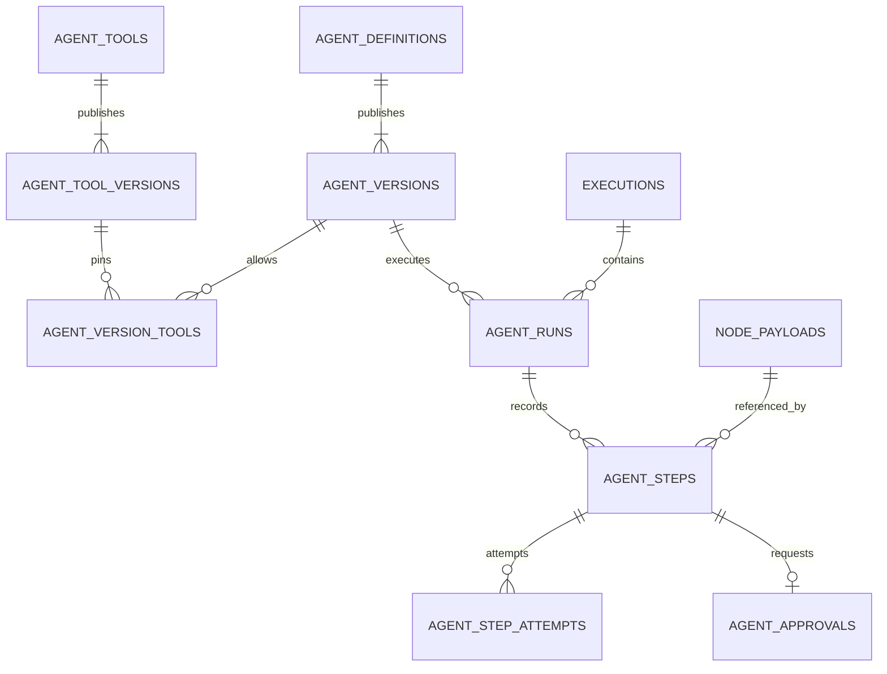
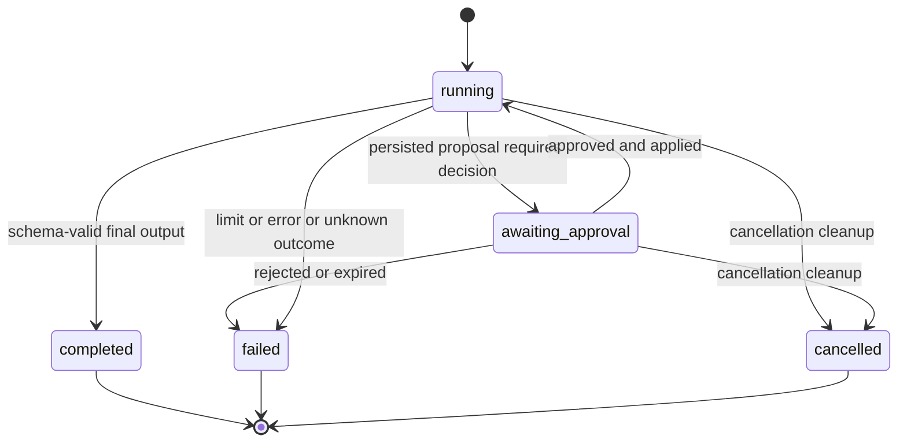

# Cohestra agents: backend low-level design

Status: implementation specification, 2026-09-14. Develops the user-approved agent direction in [backend architecture](BACKEND_ARCHITECTURE.md) and [system HLD](ARCHITECTURE_HLD.md). **All agent tables, endpoints, DTOs and algorithms below are proposed additions, not existing APIs.** Existing application baseline is `857f36f51d9d58c05b32a4d2941448b1eeebbcbd`. No application implementation is included in this document.

## 1. Fixed decisions and bounds

Reuse Go, pgx, the Temporal SDK, existing authentication/ACLs, AES-GCM utilities, payload storage and safe HTTP transport. Native agents run as child workflows in the current queues. Reusable agents/tools are owner-managed; using an agent node inherits the parent pipeline's authorization. Approvers are human workspace owners or parent-pipeline admins. Service tokens cannot approve in v1. Effective capabilities are calculated by the server for every resource response; they do not replace API authorization.

The first flow uses workflow-engine bounded batches and existing coded sinks. B1 rejects unsupported manifest-only sinks at registration/catalog admission until an explicit sink write contract is implemented. Per-record parallelism, new scheduling systems, a tool marketplace, cross-run memory and adapter factories are outside B1–B5.

Initial definition defaults, validated against operator/tenant/model ceilings: `maxSteps=8`, `maxToolCalls=4`, `maxInputTokens=16384`, `maxOutputTokens=4096`, `maxOutputTokensPerCall=512`, `deadlineSeconds=900`, `approvalTtlSeconds=600`, and no monetary cap (`maxCostMicros=null`, `currency=null`). Steps here mean actual model attempts, including repairs and retries; logical tool calls have their own counter. All numeric limits are positive bounded integers; per-call output cannot exceed remaining output allowance; approval expiry cannot exceed the run deadline. These are conservative implementation defaults, not a latency SLO or an approved model recommendation.

Local model-host admission: profiles declare `deploymentConcurrency:1` initially on the 18 GiB host. The operator configures the shared Ollama process with `OLLAMA_NUM_PARALLEL=1`, `OLLAMA_MAX_LOADED_MODELS=1`, and `OLLAMA_MAX_QUEUE=8`, then verifies them with overlapping requests from separate workers/test namespaces. These server controls apply beyond a single run/process; the existing activity-worker concurrency of 20 does not provide this guarantee. [Ollama FAQ](https://docs.ollama.com/faq). Do not enable a strict local profile on an unmanaged server without capacity evidence. Server queue rejection is classified separately from a started inference; retry only within the overall deadline and reserve each potentially billable attempt. No custom distributed semaphore is required initially.

V1 resource bounds: at most 100 input records, 64 KiB projected input, 8 KiB instructions, 32 KiB total tool/schema descriptions, 64 KiB tool arguments, 256 KiB tool/model response body, 16 KiB previews, 50 paginated rows by default and 100 maximum. Model-profile context limits may require smaller inputs. Schema and decoded-body limits are enforced before allocation/dispatch; excess input fails rather than being silently sampled or truncated. A run preview may truncate with an explicit flag; execution data may not. Approval-required proposals must have a complete decision-relevant preview within 16 KiB; reject an oversized or materially redacted proposal rather than enabling approval of unseen arguments.

## 2. Public node and definition contract

```json
{
  "id": "classifyTickets",
  "type": "agent",
  "activityType": "agent.run",
  "label": "Classify tickets",
  "config": {
    "agentId": "agt_triage",
    "agentVersion": 3,
    "inputBinding": {"mode": "batch", "fields": ["ticketId", "subject", "body"], "maxRecords": 100}
  },
  "timeoutSec": 240,
  "retry": {"maximumAttempts": 2}
}
```

IDs in examples are illustrative opaque IDs. Production entity IDs are server-generated UUIDs rendered as strings, except existing execution IDs. The agent node accepts exactly one incoming reference; multiple predecessors require an explicit merge. `fields` is a nonempty unique list of literal top-level keys, not expressions or dotted paths. All fields must exist in every record. The projected array must satisfy the immutable version's input schema. Final output must satisfy its output schema and the downstream record-array contract; an existing transform handles an explicit conversion. Do not embed credentials, instructions or mutable model names in node configuration.

Owner publication request, `POST /api/agents/{id}/versions`:

```json
{
  "requestId": "c64bd2e7-a831-4ac7-86dd-aeea87390601",
  "expectedVersion": 2,
  "definition": {
    "name": "Ticket triage",
    "instructions": "Classify the supplied tickets. Propose a ticket update only through the allowed tool.",
    "modelProfileId": "local-evaluated-profile",
    "inputSchema": {"type": "array", "items": {"type": "object", "required": ["ticketId", "subject", "body"]}},
    "outputSchema": {"type": "array", "items": {"type": "object", "required": ["ticketId", "category"]}},
    "tools": [{"toolId": "tool_update_ticket", "version": 2}],
    "limits": {"maxSteps": 8, "maxToolCalls": 4, "maxInputTokens": 16384, "maxOutputTokens": 4096, "maxOutputTokensPerCall": 512, "deadlineSeconds": 900, "approvalTtlSeconds": 600, "maxCostMicros": null, "currency": null},
    "memoryPolicy": {"scope": "run", "retentionDays": 7}
  }
}
```

Creation uses the same wrapper at `POST /api/agents`, without `expectedVersion`. Publication returns `201 {"id":"agt_triage","version":3,"revision":4}`. `revision` belongs to mutable resource state; `version` selects an immutable executable definition. Server normalizes defaults, validates profile/tool ownership and schemas, encrypts instructions, and pins hashes. A client cannot supply tenant ID, effect policy, arbitrary model endpoint, or secret content through the agent definition.

Schemas use a bounded supported JSON Schema subset: object/array/string/number/integer/boolean/null, properties/required/additionalProperties/items, enum, numeric bounds, and string/array length bounds. Reject remote references and unsupported schema keywords at publication; do not silently ignore them. Reuse a suitable installed validator if available when implementing; otherwise one maintained validator is justified by this trust boundary, with a compatibility fixture. There is no custom schema language.

## 3. PostgreSQL records and relationships



Every new table has `tenant_id UUID NOT NULL`, created/updated timestamps as applicable, tenant-scoped indexes, RLS, and explicit tenant predicates in worker queries. All relationships use composite `(tenant_id, ...)` keys; add a unique `(tenant_id,id)` on referenced existing tables where needed. Foreign keys prevent a run, version, connection or approval from crossing tenants. V1 does not rely on the worker's database role to enforce RLS automatically.

| Proposed table | Fields beyond tenant/timestamps | Constraints and indexes |
| --- | --- | --- |
| `agent_definitions` | `id`, `name`, `head_version`, `revision`, `disabled`, `created_by` | PK tenant/id; head version updated under row lock; index tenant/created_at/id. |
| `agent_versions` | `agent_id`, `version`, non-secret normalized `definition JSONB`, encrypted instructions/IV/key reference, `model_profile_snapshot JSONB`, `model_profile_config_hash`, `definition_hash`, `created_by` | PK tenant/agent/version; immutable once published; parent FK; no secret body in definition JSONB. |
| `agent_tools`, `agent_tool_versions` | Stable tool identity/revision/disabled plus immutable endpoint reference, connection ID, transport, name/method, schema hashes, effect, policy, retry/reconciliation declaration | Same identity/version pattern; composite connection FK or equivalent ownership check for approved platform profiles. Changing endpoint/schema/policy creates a version. |
| `agent_version_tools` | `agent_id`, `agent_version`, `tool_id`, `tool_version` | Composite FKs to both versions; unique allowlist binding; no mutable latest pointer. |
| `agent_runs` | `id`, `execution_id`, `node_id`, agent/version, profile snapshot/digest, `phase`, `stop_reason`, `revision`, `deadline_at`, `control_state`, counter totals, `input_ref`, `output_ref`, `content_expires_at`, wrapped content key, Temporal workflow/run identity | Unique tenant/execution/node; parent execution FK; index tenant/phase/started_at/id. Counters are nonnegative BIGINT; terminal state monotonic. |
| `agent_steps` | `id`, `run_id`, `sequence`, `kind`, `status`, tool/version when applicable, normalized argument hash, encrypted-body refs, result ref, timestamps, sanitized error | Unique tenant/run/sequence and tenant/run/id. Tool-step ID is logical call ID. Immutable proposed arguments. Tool-only columns rejected for other kinds. |
| `agent_step_attempts` | `step_id`, `attempt`, reservation counters/micro-cost, usage counters, usage completeness, provider request ID, state, lease/dispatch timestamps and persisted result | PK tenant/step/attempt. This is also the usage-reservation ledger; no second ledger with duplicate accounting. State/settlement transitions use CAS. |
| `agent_approvals` | `id`, `run_id`, tool `step_id`, bound version/destination/connection/policy/hash, expiry, status/version, actor/decision/reason/request ID, delivery/application fields | Unique tenant/run/tool-step; FK to step and run; API checks tool kind; index tenant/status/expiry/id and pending delivery. |
| `agent_api_requests` | `actor_id`, `request_id`, normalized request hash, method/resource scope, sanitized response/status or immutable result identity | PK tenant/actor/request_id. Used only by new definition/version/state writes; approval decisions deduplicate on their immutable approval record. Same key with different scope/body is 409. |

Mixed agent pipeline admission requires configured payload encryption; it cannot inherit an unencrypted development payload setup. Existing source DataRefs retain their compatibility format (including encrypted inline references); preparation materializes the bounded agent memory as opaque persisted references before model/tool execution. Reuse `node_payloads` for encrypted persisted agent content even when small; do not use inline `DataRef.Key` bodies for agent memory. Reuse existing AES-GCM primitives. Agent run content has a per-run key wrapped at rest; only activities resolve it, and no wrapped/plain content key goes into Temporal history. Agent definitions keep separately encrypted instructions while the version is retained. Agent output intended for downstream nodes is written using the existing execution payload encryption contract so ordinary sinks can read it. No new object-store service is introduced.

Add durable control intent fields to `executions`: `control_state` (`active`, `paused`, `cancel_requested`), `control_revision`, and `control_delivered_revision`; current execution phases remain unchanged. These fields support reliable parent control delivery and effect admission. Agents copy observed control into their read projection, but the parent execution row is authoritative.

Use additive migrations selected from the next available migration numbers during implementation. No destructive change to existing rows/JSON types. Retain immutable referenced versions; disabling stops future admission, it does not erase history. Request-deduplication retention must cover the documented client retry window; v1 retains it for at least the owning resource/version lifetime, rather than silently forgetting an old request ID.

## 4. HTTP reads, writes, permissions and pagination

All routes require existing bearer auth. Derive tenant/actor from `TenantContext`. Reuse the existing error envelope `{error,code,details?}`; never return database/provider internals. Cross-tenant and inaccessible resource identifiers return 404 consistently; a visible resource with a disallowed action returns 403. Version/decision conflict is 409, expired content 410, validation 400, body too large 413, and temporary provider/control-plane unavailability 503.

| Proposed route | Successful response | Permission / behavior |
| --- | --- | --- |
| `GET /api/agents`; `GET /api/agents/{id}` | Paged summaries / one summary with head version, revision, disabled and capabilities | Tenant-owned permitted definitions. |
| `GET /api/agents/{id}/versions`; `GET /api/agents/{id}/versions/{version}` | Paged version metadata / normalized immutable definition | `use_agent` exposes schemas/bindings; only `read_instructions` exposes decrypted instruction text. |
| `POST /api/agents`; `POST /api/agents/{id}/versions` | 201 identity/version/revision | Owner; requestId deduplication; publication compares expectedVersion with current head. |
| `PATCH /api/agents/{id}` | 200 resource state | Owner; `{requestId,expectedRevision,disabled:true or false}`; CAS revision; active runs retain snapshots but disabled state blocks new calls as defined below. |
| `GET/POST /api/agent-tools`; `GET /api/agent-tools/{id}`; `GET /api/agent-tools/{id}/versions/{version}`; `POST /api/agent-tools/{id}/versions`; `PATCH /api/agent-tools/{id}` | Same identity/version/state conventions | Owner manages; permitted users see safe allowlist metadata. No API arbitrary execute action. |
| `GET /api/agent-models` | Paged configured profiles | Operator-approved metadata and evidence, never a tenant-supplied endpoint. |
| `GET /api/executions/{id}/agent-runs`; `GET /api/agent-runs/{id}` | Paged child summaries / summary | Parent-pipeline read authorization. Optional `include=output` requires `read_preview`. |
| `GET /api/agent-runs/{id}/steps`; `GET /api/agent-runs/{id}/steps/{stepId}?include=preview` | Paged ordered steps / detail plus authorized preview | `read_steps`; preview requires `read_preview`, with current retention/content state. |
| `GET /api/agent-runs/{id}/usage` | Limits, consumed/reserved totals, known/unknown usage and cost | `read_usage`; no recalculation from model prose. |
| `GET /api/approvals`; `GET /api/approvals/{id}` | Paged approval snapshots / snapshot | Human owner or parent admin; decided history remains readable under current authorization. |
| `POST /api/approvals/{id}/decision` | 200 full recorded approval snapshot | `{requestId,expectedVersion,decision,reason}`; exact-call decision; idempotent same request. |
| Existing `POST /api/executions/{id}/{pause,resume,cancel}` | Preserve `ok:true`; add `controlState`, `controlRevision` | Parent execution control authorization; acknowledgement is not terminal completion. |

Paged envelope: `{"items":[],"nextCursor":null}`. Cursors are opaque, size-bounded, validated keysets, scoped to filters/tenant by server lookup; they confer no authority. Sort resource/approval lists by descending `(created_at,id)`, version history by descending version, steps by ascending sequence. No offsets or unbounded list responses. `status=pending` and `status=decided` are supported approval filters; decided includes approved/rejected/expired/cancelled. Polling is sufficient in v1.

Capability vocabulary: agent `use_agent`, owner `create_version`, `read_instructions`, `disable`; tool owner `create_version`, `disable`; eligible model `use_model`; run `read_steps`, `read_usage`, `read_preview`, and authorized nonterminal `cancel`; pending eligible approval `approve`, `reject`. Unknown capabilities are ignored by the UI. Creation controls may use the existing owner role but the server always enforces it. Existing whole-execution retry must be disabled server-side when any child has a successful or ambiguous mutation, regardless of whether a button is shown.

Model profile example: `{"id":"local-evaluated-profile","provider":"ollama","tag":"operator-selected-tag","resolvedDigest":null,"status":"unverified","observedAt":null,"contextLimit":4096,"capabilities":[],"priceKnown":false,"deploymentConcurrency":1,"evaluation":null}`. A populated tag, installed weights, or marketing claims do not establish readiness. Profiles can carry measured structured-output/tool-use capability and evaluation provenance after a check; there is no automatic default promotion or fallback.

Run summary:

```json
{
  "id": "ar_triage_1", "executionId": "exec_example", "nodeId": "classifyTickets",
  "agentId": "agt_triage", "agentVersion": 3, "phase": "awaiting_approval",
  "controlState": "active", "stopReason": null, "revision": 7,
  "startedAt": "2026-09-14T09:00:00Z", "completedAt": null,
  "model": {"profileId": "local-evaluated-profile", "tag": "operator-selected-tag", "resolvedDigest": "recorded-at-admission"},
  "pendingApprovalIds": ["approval_1"], "outputAvailable": false,
  "capabilities": ["read_steps", "read_usage", "read_preview", "cancel"]
}
```

Step summary fields are `id`, `sequence`, `kind`, `status`, `attempt`, `startedAt`, `completedAt`, `usage`, `previewAvailable`, and `contentStatus` (`available`, `expired`, `restricted`). Detail adds `preview:{input?,output?,truncated}` after authorization. Never return a raw storage bucket/key, signed URL, credential, or hidden reasoning. `read_preview` does not grant `read_instructions`: model-step input previews omit agent/system instruction segments unless the caller separately has `read_instructions`. Enforce this in server projections, exports and history views, not only the browser. Store prompt segments with their disclosure classification so a concatenated full prompt is never the default preview. Usage is `{limits,consumed,reserved,usageComplete,cost:{consumedMicros,reservedMicros,currency,known}}`; unknown monetary values are null, token/attempt counters remain numeric. A local model with no configured price has `known:false`, not a known zero charge.

Approval snapshot before a decision:

```json
{
  "id": "approval_1", "runId": "ar_triage_1", "executionId": "exec_example", "nodeId": "classifyTickets",
  "version": 1, "status": "pending",
  "tool": {"id": "tool_update_ticket", "version": 2, "name": "Update ticket", "effect": "write", "destination": "approved-ticket-service"},
  "argumentHash": "sha256:aaaaaaaaaaaaaaaaaaaaaaaaaaaaaaaaaaaaaaaaaaaaaaaaaaaaaaaaaaaaaaaa", "argumentPreview": {"ticketId": "synthetic-42", "category": "billing"},
  "expiresAt": "2026-09-14T09:10:00Z", "decision": null,
  "deliveryStatus": "not_required", "applicationStatus": "not_applied",
  "capabilities": ["approve", "reject"]
}
```

Decision is `{requestId,expectedVersion:1,decision:"approve",reason:"Reviewed synthetic ticket update"}`. Response becomes status approved/version 2 with `decision:{requestId,value,actorId,decidedAt,reason}`, `deliveryStatus:"pending"`, `applicationStatus:"not_applied"`, and no approve/reject capabilities. Delivery changes to delivered only after signal acknowledgement; application changes to applied after the child consumes the decision. Child failure after application still does not mean the tool succeeded. Conflict example: `{"error":"approval is already decided","code":"ERR_APPROVAL_CONFLICT","details":{"currentVersion":2,"currentStatus":"approved"}}`. Validation details use `fieldErrors:[{path,message}]`; stable paths match frontend fields.

## 5. Version and request algorithms

New definition/state writes run in `TenantTx`: claim `(tenant,actor,requestId)` → compare normalized method/resource/body hash → lock resource → validate expectedVersion/revision and references → insert immutable version or change disabled state → audit → store sanitized response identity → commit. A duplicate with the same hash returns the stored response/status even if the current head advanced; the client can read current state afterward. A different hash is 409. Unknown request outcome is reconciled with the same ID, not a new publication. JSON decoding rejects duplicate keys/non-finite values; normalize schema-supported values before hashing. Public argument hashes use `sha256:` followed by 64 lowercase hexadecimal digits; the algorithm prefix is part of the wire contract. Preserve exact string values; the hash covers tool version, connection/destination/policy identity and normalized arguments.

Agent versions pin tool versions and normalized model configuration. At publication, resolve `modelProfileId` into an immutable `model_profile_snapshot` containing provider, approved endpoint identity, tag, context/output options, capability/evaluation references, concurrency and price policy, plus a configuration hash. The public exact-version response may expose this non-secret snapshot as `modelProfileSnapshot`; list responses need only profile identity. Workers execute the saved snapshot and check that its live referenced profile remains enabled. Changes to endpoint/model settings require a new agent version; secret rotation at the same authorized credential reference is permitted without copying secret values. Agent run admission resolves the actual serving digest once and verifies required capability evidence for that digest, then records it in the run. A tag retargeted to an unevaluated digest fails admission rather than inheriting old capability claims. A later digest mismatch fails closed for that run; never silently retag/reload another model mid-run. Profile/tool/agent disabled controls are current deny controls: disabling an agent blocks new runs; disabling its model or a tool blocks the next affected call. Explicit policy/credential revocation also blocks subsequent calls. Existing snapshots remain available as historical metadata.

## 6. State transitions



Pause is `controlState=paused`, not another agent phase. A paused run may record an approval but cannot admit the tool until resume. Terminal runs never reopen; reconciliation can append evidence without changing a failed run to completed. A new authorized execution is a new run and new approval scope.

Tool steps: pending → running (admitted) → succeeded/failed/unknown_outcome; pending can cancel without dispatch. A running step cancelled after remote acceptance becomes succeeded if confirmed, or unknown_outcome if not confirmable; the parent may still terminate cancelled while retaining that step outcome. Approval transitions: pending → approved/rejected/expired/cancelled, each exactly once. Approved rows are not rewritten to cancelled; run cancellation prevents admission and records separate control evidence. `stopReason` includes budget_exhausted, max_steps, deadline, approval_rejected, approval_expired, unknown_outcome, invalid_model_output, policy_revoked, and provider_unavailable.

## 7. Temporal and activity algorithm

Register `AgentWorkflow` on existing workflow queues, and a small activity set on existing activity queues: `prepareAgentRun`, `executeAgentModelStep`, `prepareAgentToolCall`, `readAgentApproval`, `executeAgentToolCall`, `finalizeAgentRun`, and shared control/status persistence. Activities may share helpers; these are logical operations, not separate services.

1. Parent derives a stable child ID from execution/node and starts one child with trusted tenant/execution/node IDs, pinned version, input ref and limits. Child workflow retry is disabled; workflow-task replay is retained. Use a stable logical run ID derived from the child ID; do not use Temporal attempt/run ID as the external effect key. Parent close policy requests cancellation and waits for child cancellation when parent control is active.
2. `prepareAgentRun` is idempotent under unique tenant/execution/node. Verify the persisted parent row, pipeline access/version, profile/tool state and input ownership. Existing `fireExecution` starts Temporal before inserting execution metadata: preparation must bounded-retry a not-yet-visible parent row and cannot contact a model/tool until it exists. Scheduled preparation must remain idempotent. If metadata persistence failed, parent termination prevents admission; do not create an orphan executable child.
3. Load/project/validate bounded input; persist encrypted run memory and snapshot. Only IDs, hashes, references, counters and sanitized status cross activity/workflow boundaries. Even the model's final answer and tool arguments return opaque refs; model HTTP response bodies never enter workflow history directly.
4. Allocate stable logical step sequence. Execute model step with activity automatic attempts set to one. The activity first returns an already persisted successful logical result if present; otherwise it reserves/executes/settles one provider attempt. Workflow schedules a bounded retry only for a classified retryable failure, using the same logical step and a new attempt number. Every actual provider attempt counts toward maxSteps and reserves budget; repair is also a new bounded model attempt. One repair per malformed decision, matching the existing planner's bounded practice, is enough initially.
5. Model decision is a validated union: `{kind:"final",output:...}` or `{kind:"tools",calls:[{toolId,toolVersion,arguments:...}]}`. Reject extra alternatives, unknown tools, empty/excess calls, oversized args, or a claimed final answer containing executable directives. Persist tool calls in response order, assign stable logical IDs, and execute them serially. Metadata, schemas and results are untrusted content, never permission.
6. `prepareAgentToolCall` validates binding and persists the tool step plus approval when required. Child waits with a selector on approval signal, expiry/deadline timer and parent control. Signal payload is only approval ID/version; `readAgentApproval` re-reads authoritative state and records application once. No workflow-side SQL or real clock.
7. Execute permitted tool under the algorithm below, persist its output, then append that result to bounded run memory. At the next iteration enforce context/token limits; fail explicitly if the conversation exceeds them. V1 does not summarize away tool evidence or silently truncate. Final output passes schema validation, is written under the existing execution DataRef contract and returns `NodeResult{status:"success",outputRef,meta:{agentRunId}}` to the DAG.
8. Deferred finalization uses bounded disconnected activity cleanup to record phase/reason, unresolved usage and pending approvals. It must run on ordinary errors and cancellation. Persistent finalization failures leave a visible reconciliation-required operational record; a B5 reconciler checks Temporal terminal state against stale run projections. Cleanup cannot issue new business effects.

Use Temporal deterministic time/timers and recorded activity results only. Gate changes to existing parent command order with a version marker such as `agents-v1`; replay the stored data-only fixture on old/new code paths. Old signal names stay compatible. New agent histories also need representative replay fixtures before changing activity names/input shapes. B3 bounds history; Continue-As-New is not required initially. Rollback disables new admission and keeps compatible workers until new histories drain.

## 8. Approval transaction and delivery

Decision handler: authenticate human → authorize parent pipeline → `TenantTx` → lock approval → if same decision request/hash already committed, return it → compare version/pending state → atomically check expiry against database time → verify exact call binding → update decision/version → append audit → mark delivery pending → commit. It does not call a tool. Reject different reuse of the request ID or stale/conflicting decisions with 409.

Child expiry activity competes with decision using the same row lock and pending-state predicate. A decision committed before expiry remains decided if signal delivery is late. Expiry cannot replace an already approved row. Cancelling a pending run atomically closes still-pending approvals; approval and cancellation serialize against effect admission through the execution/run lock ordering below.

The activity-worker-owned delivery loop claims pending approval rows in bounded batches using `FOR UPDATE SKIP LOCKED`, with a short delivery lease; commit the claim before network I/O. Signal by stored tenant/environment/workflow identity. Mark delivered conditionally on the same decision version; on failure release/expire the lease and retry with bounded backoff. A crash after a successful signal but before the delivery mark causes safe redelivery. The child deduplicates by approval ID/version and reads the row; it never executes from the signal's asserted decision. Delivery continues until acknowledged or terminal-state reconciliation says the child cannot consume it. Retain last sanitized error for the inspector.

## 9. Effect admission, attempts and recovery

Use lock ordering **execution → agent_run → step → attempt/approval** consistently. Transactions are short and never hold locks across network calls. Admission verifies active control, live tool/profile/credential policy, immutable hashes, approved binding, bounds and available allowance; it atomically records call intent/audit, reserves allowance and marks the attempt admitted. This commit is the linearization point relative to pause/cancel/revocation. A previously admitted request may still reach the remote service after control changes; API/UI never promise otherwise.

| Existing logical-call state | Action |
| --- | --- |
| Succeeded | Return persisted result, no new remote request or allowance. |
| Pending, not admitted | Validate/admit one attempt. |
| Live running attempt | Do not start another worker request; return retryable in-progress status and wait within deadline. |
| Attempt uncertain after lease/timeout | Read-only: bounded retry; remote-idempotent write: reconcile/retry same key within provider window; non-idempotent write: unknown_outcome and stop. |
| Argument/version/connection hash differs | Nonretryable conflict; require a new call and approval. |

Stable remote idempotency key derives from tenant/run/logical tool call; activity retry number is excluded. HTTP key placement is a reviewed tool-version setting; MCP request ID is not an idempotency guarantee. Claiming idempotence requires a documented provider contract plus fixture test; expiry of its deduplication window disables automatic retry. Leases prevent concurrent ordinary dispatch, but do not magically fence a slow remote request; remote idempotency remains essential for repeated writes.

Tools without remote idempotency/reconciliation get one dispatch attempt. If sending may have occurred and no persisted confirmed result exists, mark unknown_outcome, retain the reservation, and stop the run. This applies even if the worker died after remote success before database persistence. A connection failure proven before dispatch may be classified safe to retry; uncertain cases default to unknown. Recovery never infers success or failure from lack of an acknowledgement. A later operator reconciliation appends evidence; repeating an effect requires a new explicitly approved execution.

MCP v1 uses approved remote Streamable HTTP endpoints and pinned schema hashes. Workers enforce destination/redirect/DNS checks through the existing safe client, schema/size limits and cancellation. A trusted internal endpoint requires operator-managed configuration, not a tenant override. Reuse existing connection secret resolution; no bearer values or credentials in messages/history. Dynamic discovery can create a draft version, never silently alter the executable allowlist.

## 10. Budget accounting and model context

Reservation and settlement use `agent_step_attempts` under the run lock. For each model provider attempt, reserve a verified upper bound on prompt tokens and the requested output cap, plus the corresponding price snapshot if configured. Check consumed + outstanding reservations + proposed reservation against every limit atomically. Increment the model-attempt counter only on admitted provider attempts. For tools, count each logical call once; record/restrict remote attempts separately so an idempotent retry cannot become an unlimited request loop.

A supported profile must offer exact tokenization or a verified conservative bound for its tokenizer/template, a context ceiling, and a provider-enforced output cap. Do not assume characters equal tokens or all models share a byte bound. If a strict monetary/token guarantee cannot be supported, reject that strict configuration and expose unavailable capability. For Ollama set the appropriate bounded context/output options in the activity, distinct from the current planner helper; verify on the exact digest before marking the profile ready.

Successful usage settlement CASes reserved → settled once, removes that reservation from outstanding totals, and adds actual usage. Provider timeouts/missing usage keep conservative unknown reservations; retries reserve additionally. Late usage can reconcile exactly one attempt, never double-count. If actual usage exceeds a promised reservation bound, record the overage, stop future calls and mark the profile's guarantee invalid for investigation; never hide overage by clamping numbers. Costs use integer micro-units with currency and a pinned price source; never floating-point currency arithmetic. Unknown price/compute cost remains null.

`timeoutSec` caps each node activity's start-to-close duration; agent deadline bounds the entire loop including queues/approvals. Model/tool-specific timeout is the minimum of remaining deadline, node override and transport limit. Node maximumAttempts never loosens an effect-specific no-retry rule. Database-only idempotent operations may use bounded Temporal automatic retries; model/tool external attempts are explicitly accounted as above.

## 11. Pause, cancel, stale projection and retention

Existing control endpoint records the latest execution control_state/revision and audit transactionally. A dispatcher sends the existing pause/resume/cancel signal with a revision hint and marks delivered revision only conditionally; changed intent is delivered again. New workflow code reads current durable control through an activity, ignores stale revisions, and forwards control to active children. Legacy history follows its preserved version branch. Every new effect admission checks the authoritative execution row, so delayed signal delivery cannot authorize a new effect after pause/cancel wins admission order.

Pause waits after admitted work completes; no new model/tool/sink is admitted while paused. Resume is rejected for cancel_requested or terminal execution. Cancel marks pending approvals cancelled, cancels child/activity contexts, observes heartbeats and records outcomes. HTTP cancellation does not prove remote rollback. Deadline follows the same stop/cleanup discipline with a failed/deadline reason. Parent must consume controls while futures are active, not only at DAG level boundaries; failed/cancelled agent output must not reach downstream sinks.

Run memory content is encrypted and indexed by tenant/execution/node or step ownership; reads enforce actual decoded-byte bounds, not a caller's declared size. Default retention is seven days and cannot exceed operator policy. Cleanup first marks content expired to reject API reads, then removes referenced bodies and wrapped run key; repeat cleanup is safe. Definition instructions remain governed by version lifecycle, and published final DataRefs/sink data retain existing data retention. Backup/key-retention deployment policy controls when deletion is irreversible; UI must not claim wider deletion.

Workflow terminal status and PostgreSQL read projection may briefly differ. Return revision and last-updated time; a finalization/reconciliation worker repairs terminal projections idempotently using stored Temporal identity. A missing activity audit/effect record is not silently synthesized as success. Alert on stale running rows beyond deadline, delivery backlog, unknown outcomes, usage overage/unknown reservations, payload-cleanup failures and worker queue delay. Preserve basic records in OSS; existing enterprise deep traces remain separate.

## 12. Implementation ownership and tests

Paths without links below are proposed files; numbered SQL migrations are assigned from the current next available number. Keep helpers close to their actual users, rather than building a new framework.

| Module/file ownership | Change |
| --- | --- |
| `internal/model/agents.go`; existing `internal/model/types.go` | DTOs/enums/config; additive agent node validation; stable JSON fixture names shared with frontend. |
| `internal/api/routes_agents.go`, `routes_agent_tools.go`, `routes_agent_runs.go`, `routes_approvals.go` | Resource APIs, optimistic publication, effective capabilities, bounded reads and decision transaction. |
| Existing `internal/api/auth.go`, `pipeline_validation.go`, `routes_executions.go`, `temporal.go` | Reuse tenant/ACL checks; prevent unsafe rerun; compatible admission/control and engine validation. |
| `internal/workflows/agent.go`; existing `dynamic_dag.go` | Deterministic loop, child/parent controls, version marker, replay behavior. |
| `internal/activities/agents.go`, `agent_tools.go`; existing `payloads.go` | Provider calls/validation, transactional ledgers, safe tool transport, persisted encrypted memory and final output. Split only where responsibility warrants. |
| Existing `internal/dispatchers/dispatchers.go` | Approval/control delivery, terminal projection/retention jobs using existing lifecycle pattern. |
| `db/NNN_agents.sql` and follow-on stage migrations | Tenant keys/RLS, immutable records, admission/usage/approval constraints and indexes. |
| Existing worker entrypoints/config and `internal/connectors/registry.go` | Register operations on existing queues; operator profile bounds; reject unsupported sink admission. |
| `tests/contracts` and focused Go tests; `tests/ai-evals` separately | Wire/algorithm/replay/sandbox fixtures; corrected planner corpus remains a separate quality gate. |

| Milestone | Ordered implementation content | Required proof before merge |
| --- | --- | --- |
| B1 / F1 | Per-node timeout/retry, lossless frontend round-trip, unsupported sink rejection, responsive/durable control and agent contract fixtures; introduce parent history version branch | S01–S03/S13, old replay fixture, invalid settings/engine rejection, both editions. |
| B2 / F2 | Add definitions/tools/model profiles, version reads/publication/dedupe, disabled controls, tenant/credential constraints, encrypted definition storage | Two-tenant CRUD/version/connection tests, stale and duplicate writes, no instruction/credential leaks through detail/preview/export; model-less deterministic tests pass. |
| B3 / F3 | Register bounded child and model-only activity flow, run/step/usage reads, persisted memory, reservation/settlement, final DataRef and cleanup | Deterministic valid/invalid model fixtures, budget/timeout/concurrent reservations, shared-host generation cap across workers, restart before/after model response, cancel, replay; tools still denied. |
| B4 / F4 | Tool step ledger, approval transaction and delivery, HTTP/MCP allowlist, safe retry/unknown outcome handling | S07–S15; full source→approved write→typed sink; crash at every admission/send/persist boundary; duplicate/expired/revoked decision; SSRF/schema/body limits. |
| B5 / F5 | Audit/monitoring/lineage projections, retention and stale-run reconciliation, rollout/rollback evidence | S16/S18, fault-injection across API/worker/DB delivery outages, cleanup and role journeys, backup/retention operational documentation. |
| B6 / F6 | One separately reviewed LangGraph adapter and optional scoped memory | S17 plus the native effect/approval/budget/cancel contract; no second unchecked tool authority. |

Use existing Go tests/race/vet, Temporal test environment/replay fixtures, PostgreSQL RLS integration and deterministic HTTP/MCP/model services. Required crash points include after reservation, after approval commit before signal, after remote acceptance before result persistence, and after result persistence before activity acknowledgement. Assert external effect count and call key, not only a final status. Existing historical CI passing is useful baseline evidence; none of these future agent integration cases is claimed implemented here.

Planner corpus fixes, paired real-model evaluation and default promotion (G04/G11) run separately. They do not block deterministic B1/B2 or permission/storage work; enabling a real profile for B3/B4 requires its actual capability evidence. Remaining deployment inputs are operator endpoint/credentials, model capability evidence, intended-hardware concurrency and retention policy. They are configuration/release gates, not a reason to reopen the already approved architecture or stall implementation of its deterministic foundation.
